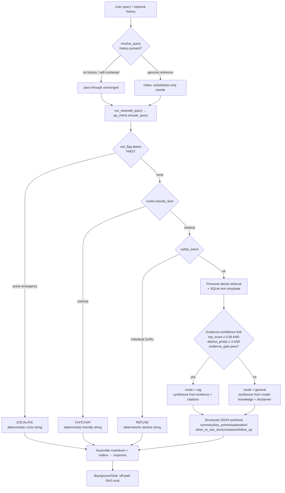
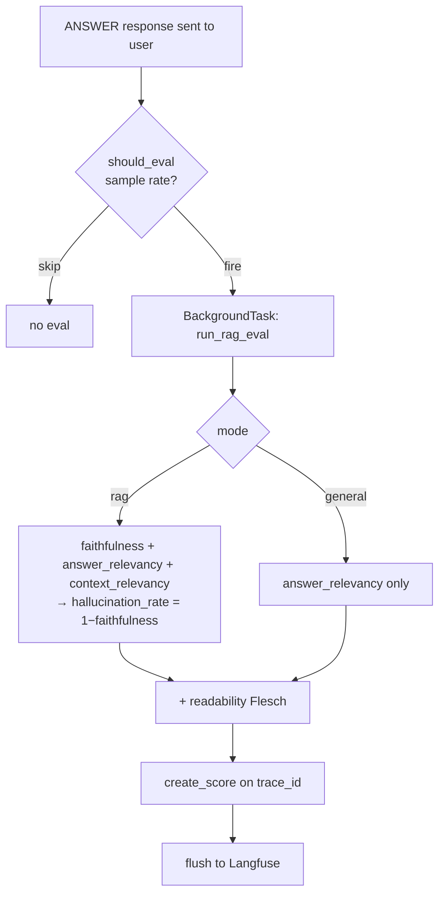

# WiseWell — Design Rationale

> A reference document explaining **why** WiseWell is built the way it is. Every
> technical claim is grounded in the actual code in this repo (file + function
> cited). If you (future me) forget the reasoning behind a decision, this
> reconstructs it. Depth over brevity.

---

## 1. System Overview

**WiseWell is a medical-information assistant that answers health questions using
retrieval-augmented generation (RAG) over a PubMed abstract corpus.** It retrieves
real published evidence, synthesizes a plain-language answer with inline PMID
citations, and wraps the whole thing in safety guardrails (emergency escalation,
medical-advice refusal) so it never acts like a doctor.

The corpus is ~620k abstract chunks (619,694 vectors, 384-dim, cosine) living in a
Pinecone index `wisewell-abstracts` (`config.py` → `PINECONE_INDEX_NAME`). The bot
is **stateless and single-turn by request** — multi-turn context is passed by the
client and resolved into a standalone query before any guardrail runs
(`backend/schemas.py` → `QueryRequest.history`).

### Request flow



The orchestration entry point is `orchestration/service.py::run_wisewell_query`,
which calls `scripts/qa_check.py::answer_query` (the actual pipeline). The HTTP
layer is `backend/routes/query.py::query_endpoint`.

---

## 2. Architecture Decisions

### 2.1 Pinecone (dense) replaced the FAISS + BM25 hybrid

**Decision:** Retrieval is now pure dense vector search against Pinecone
(`retrieval/pinecone_retriever.py`), replacing the in-process hybrid BM25+FAISS
retriever (`retrieval/hybrid_retriever.py`, kept only as a rollback path).

**Why:** The hybrid path held the entire corpus and indexes in process RAM. On a
small EC2 (t3.medium), loading FAISS indexes + a BM25 model + a ~400MB id-map
DataFrame at startup blocked cold start and pushed memory. Moving vectors to a
managed Pinecone index means the box no longer holds the index in RAM — it makes
a network query and gets back IDs + lean metadata. `pinecone_retriever.py` is
written as a **drop-in**: `_normalize_chunk` emits the exact same evidence schema
as the old `HybridRetriever` (same keys, `hits={"bm25": False, "faiss": True}`),
so the graph and every guardrail downstream are unchanged.

**Tradeoff:** We lose BM25's exact-term/lexical matching. Dense-only retrieval is
weaker on lab-value queries ("CRP 18 mg/L") and rare exact tokens. Two mitigations
exist in code: (1) a lab-value query rewrite (`retrieval/query_rewrite.py`,
invoked at `pinecone_retriever.py:106`) converts numeric lab values into a
conceptual query before embedding; (2) because there's no second retriever to
"agree" with, the old `require_hybrid_hit` overlap gate is disabled
(`service.py:33` passes `gate_require_hybrid_hit=False`) and its filtering job was
moved into the evidence-confidence fork (§2.4).

**Alternative considered:** Keep hybrid, shrink corpus. Rejected — the corpus size
is the product; shrinking it weakens answers. Managed vectors solve the RAM
problem without touching corpus coverage.

### 2.2 Text lives in SQLite, separate from Pinecone vectors

**Decision:** Pinecone stores **only** vectors + lean metadata (pmid, year,
chunk_index, title, journal) — **no abstract text**. The text bodies live in a
local read-only SQLite store (`retrieval/text_store.py`, built by
`scripts/build_text_store.py`). After a Pinecone query returns chunk_ids,
`PineconeRetriever.retrieve` rehydrates the text in one batched SQLite query
(`pinecone_retriever.py:124-126`).

**Why:** Two reasons, both in the code comments. (1) **Cost/limits** — storing
full abstract text in Pinecone metadata bloats the index and hits metadata size
limits. (2) **RAM** — the SQLite store "replaces the ~400MB in-RAM id_map
DataFrame" (`text_store.py:4-7`); the connection is opened **read-only and lazily**
so importing it "never blocks FastAPI cold start and never holds the corpus in
process RAM" (`text_store.py:9-10`). A single read-only connection with
`check_same_thread=False` serves FastAPI's worker threads; reads are short and
serialized by SQLite under the GIL (`text_store.py:55-64`).

**Tradeoff:** The text store is an on-box artifact the deploy must build
(`scripts/build_text_store.py`) — it is **not** in git (it's gigabytes). If a
vector exists in Pinecone but its text is missing from SQLite, the retriever
**skips** that hit rather than emitting a citation with no body
(`pinecone_retriever.py:135-139`) — fail-safe, never a dangling citation.

### 2.3 Direct Anthropic API replaced AWS Bedrock

**Decision:** Synthesis calls the Anthropic API directly with model
`claude-haiku-4-5` (`config.py` → `ANTHROPIC_MODEL_ID`, used in
`orchestration/llm_syntheses.py`). The previous version used AWS Bedrock
(Claude via `boto3`, IAM-role auth, no API key).

**Why:** The migration commit (`fcf1ccf` "Pinecone migration … Anthropic API
synthesis") moved synthesis off Bedrock. Direct API removes the AWS region/Bedrock
model-availability coupling (the old Bedrock id was region-pinned:
`eu.anthropic.claude-haiku-4-5-…-v1:0`) and uses a single portable
`ANTHROPIC_API_KEY` read via `python-dotenv`. It also makes local dev identical to
prod (no IAM role needed locally).

**Tradeoff (deploy-critical):** main authenticated via the EC2's **IAM role** and
needed **no LLM key**. This branch needs `ANTHROPIC_API_KEY` in the EC2 `.env` or
every synthesis fails. This is the single biggest production-provisioning change
from main.

### 2.4 The 0.58 evidence-confidence fork (RAG vs general)

**Decision:** After retrieval, a fork decides whether to answer in **RAG mode**
(cited, evidence-grounded) or **general mode** (model's own knowledge + a
disclaimer). The bar (`config.py`):

```python
RAG_MIN_TOP_SCORE: float    = 0.58
RAG_MIN_DISTINCT_PMIDS: int = 3
```

The decision (`scripts/qa_check.py:292-294`):

```python
rag_confident = (gd.decision == "pass"
                 and top_score >= RAG_MIN_TOP_SCORE
                 and distinct_pmids >= RAG_MIN_DISTINCT_PMIDS)
```

- **RAG mode** (`rag_confident == True`): retrieval is strong enough to ground a
  cited answer. Synthesis uses **only** the retrieved evidence and cites PMIDs.
- **General mode** (otherwise): retrieval was too weak to cite safely. The LLM
  answers from general knowledge, and code appends a disclaimer ("this is general
  medical knowledge rather than a specific study"). No PMIDs are fabricated.

**Why 0.58, and why data-driven:** The threshold was chosen by running
`scripts/validate_threshold_split.py` — ~20 varied educational queries through the
real production fork, tabulating where each lands, and flagging the **0.54–0.57
band** just under the bar. The decision rule (documented in that script's header):
if good educational queries cluster in 0.54–0.57 → lower the bar or add query
expansion; if only odd phrasings fall under → keep 0.58. 0.58 "sits just ABOVE the
dense noise floor (raw lab-value drift topped out ~0.55), so genuine matches clear
it and drift does not" (`config.py` comment). The script also probes whether a
light expansion ("`<q>` clinical significance") would lift a borderline query over
the bar — the same insight that fixed lab-value queries.

**Why the fork absorbs the old gate:** Before, weak retrieval was filtered by the
`require_hybrid_hit` overlap gate (needs both BM25 and FAISS to hit). Dense-only
has no second retriever, so that gate is disabled and the **fork** now does the
"is this retrieval trustworthy enough to cite?" job. Note the other quality gates
(topic/overlap/mechanism) are **advisory** here, not hard RAG blockers
(`qa_check.py:286-291`): gating RAG on all of them pushed too many legitimate
answers into general mode.

| | Decision | Why | Tradeoff |
|---|---|---|---|
| Fork bar | `top_score≥0.58 AND distinct_pmids≥3 AND evidence_gate=pass` | Bar set deliberately HIGH so mediocre retrieval can't masquerade as authoritative weak-RAG | Some answerable-from-evidence queries fall to general mode (no citations) — safer than a falsely-cited weak answer |

### 2.5 Conservative, reference-only query resolver (multi-turn)

**Decision:** `orchestration/query_resolver.py::resolve_query` resolves follow-ups
against recent history **only when there is a genuine unresolved reference**, and
when it does, it performs **substitution only** — never additive rewriting.

**The multi-turn problem:** The pipeline is single-turn by design (guardrails
evaluate one message). A follow-up like "how is it treated" is meaningless alone —
"it" refers to a prior turn. So the client passes the last N exchanges
(`DEFAULT_HISTORY_TURNS = 3`, ×2 turns) and the resolver rewrites the follow-up
into a standalone query *before* the router/guardrails see it.

**The two failure modes it balances** (this is the crux):

1. **Over-injection / context bleed** — the resolver fabricates or imports context
   that wasn't in the current query. This was a *real, measured* bug: after an
   RA-heavy conversation, the old resolver turned `"is coffee bad for me"` into
   `"is coffee bad for me if I have rheumatoid arthritis?"`, turned
   `"should I stop taking my blood pressure medication"` into
   `"…while I'm having a heart attack"` (fabricated from an earlier turn → caused a
   **false ESCALATE**), and turned `"write me a Python function"` into a
   methotrexate-flavored query that bypassed domain scoping. The corruption was
   measurable in the eval scores: corrupted queries scored **faithfulness 0.0 /
   hallucination_rate 1.0** because the answer wasn't grounded in the (wrongly
   retrieved) contexts, while clean queries scored 1.0.

2. **Under-resolution** — failing to resolve a genuine reference, leaving "how is
   it treated" as an unanswerable fragment. Over-correcting into "never resolve"
   breaks legitimate follow-ups.

**How the code balances them:** A heuristic gate (`_needs_resolution`) decides
whether to even call the LLM. Resolution fires only on:
- **Reference pronouns/deictics** (`_REFERENCE_PRONOUNS`): `it, its, it's, that,
  this, these, those, them, they, their, theirs`. First-person (`I/me/my/we/our`)
  is **deliberately excluded** — it appears in self-contained personal queries
  ("should I stop my meds") and must not trigger.
- **Fragment prefixes** (`_FRAGMENT_PREFIX`): `what about, how about, and, but,
  also, or, what else, anything else`.
- **Bare attribute questions** (`_ATTRIBUTE`): `side effects, symptoms, causes,
  treatment, dose, risks, prevention, …` — but only if there's no `" of "` (so
  "benefits *of* exercise" is self-contained) and the query is ≤6 words.

If none match, the query passes through **unchanged** with `was_resolved=False`
and **never reaches the LLM** — guaranteeing standalone queries can't be corrupted.
When it does call the LLM, the prompt is strict substitution-only with the real
failure cases as negative examples ("`is coffee bad for me` → MUST stay verbatim").
A post-check (`resolved.lower() != query.lower()`) reports `was_resolved=False` if
the LLM returned it unchanged.

**Verified behavior** (from the fix's validation):

| Query (after RA conversation) | Resolved to | Routing |
|---|---|---|
| `is coffee bad for me` | itself (passthru) | answer about coffee |
| `should I stop my blood pressure medication` | itself | **REFUSE** (not ESCALATE) |
| `write me a Python function` | itself | domain redirect (not RAG) |
| `how is it treated` | `how is rheumatoid arthritis treated` | RA treatment |
| `what are the side effects` | `…of rheumatoid arthritis treatment` | RA side effects |

**Safety note:** Because the resolver no longer fabricates "while I'm having a
heart attack", the BP-meds question resolves to itself and routes to REFUSE
(medication-decision decline), not a false emergency ESCALATE.

---

## 3. Safety Architecture

**Six decision types** (mapped in `orchestration/service.py::_MODE_DECISION`):

| Decision | Mode | Meaning | Synthesized? |
|---|---|---|---|
| `ANSWER` | rag / general | Real answer | Yes (LLM) |
| `ESCALATE` | escalate | Active emergency / self-harm | **No** — deterministic |
| `REFUSE` | refuse | Individual Dx/Rx request declined | **No** — deterministic |
| `CHITCHAT` | chitchat | Greeting/thanks/meta | **No** — deterministic |
| `CLARIFY` | clarify | Too vague to answer | **No** — deterministic |
| `ABSTAIN` | abstain | Can't answer confidently | **No** — deterministic |

### Why red-flag detection runs FIRST

`detect_red_flag` (`guardrails/red_flags.py`) runs at the very front of
`answer_query`, **before** the router, retrieval, everything. The rationale in the
code: "an active emergency does not wait for retrieval" (`red_flags.py` header). If
someone is having a heart attack, the system must surface 999/crisis help
immediately — it must never depend on whether retrieval succeeded or the LLM was
reachable. It is a **router-to-help, never a treater**: it points to emergency
services, it does not diagnose or manage the emergency.

### Why emergencies/refusals bypass synthesis (deterministic strings)

ESCALATE, REFUSE, CHITCHAT, CLARIFY all carry their **final answer as a
code-inserted string** (`guardrails/responses.py`) and never call the LLM. Reasons:

- **Reliability:** A crisis message ("call 999", "Samaritans 116 123") must be
  exact, every time. You cannot risk an LLM paraphrasing, softening, or
  hallucinating an emergency number.
- **No failure mode:** These paths work even if the Anthropic API is down.
- **Eval correctness:** Deterministic strings aren't graded by the judge (eval is
  meaningless on fixed text) — `observability.py::run_rag_eval` only evaluates
  `mode in ("rag", "general")`.

This is structurally enforced: synthesis is only invoked in
`query.py::query_endpoint` when `decision == "ANSWER"` and `mode in (rag, general)`.

### The physical-vs-suicide escalation split

`RedFlagDecision` carries `is_suicide` (`red_flags.py:119-124`). Suicide/self-harm
patterns are checked **first** (`_match_category` returns `("suicide", "")` before
any physical category). The two escalations get different messages:

```python
msg = responses.TIER2_SUICIDE if rf.is_suicide else responses.tier2_physical(...)
```

- **Physical emergency** (cardiac/stroke/breathing/anaphylaxis/overdose/etc.):
  a "call 999 right now" message, conditionally phrased.
- **Suicide/self-harm:** a warmer, crisis-support message leading with Samaritans
  (116 123), not a cold "call 999 emergency" template.

The frontend renders these differently too (red urgent banner vs. warm supportive
panel), but the decision split originates here in the guardrail.

### The discriminator: asking-about vs. experiencing

`detect_red_flag` deliberately distinguishes "what is a heart attack" (educational,
do NOT escalate) from "I think I'm having a heart attack" (active, ESCALATE). The
rule (`red_flags.py:18`): `escalate = red_flag_symptom AND NOT educational_framing
AND (active_now OR NOT historical_framing)`. This prevents the bot from blaring an
emergency alert at someone calmly learning about a condition.

---

## 4. Evaluation Design

This is the most deliberate part of the system. The goal: measure answer quality
**without ground-truth labels** (a solo project has none), **without** ever
slowing or breaking a user request, and in a way that **isolates distinct failure
points** so a bad score tells you *what* to fix.

### 4.1 Why LLM-as-judge at all

Answer quality here is **semantic**, not lexical. "RA is an autoimmune disease that
attacks the joints" and "Rheumatoid arthritis is a condition where the immune
system mistakenly targets joint tissue" are equally correct but share few tokens.
String/overlap metrics (BLEU/ROUGE) would score that disagreement as a failure. A
judge model reads for meaning — faithfulness to evidence, relevance to the
question — which is exactly what matters for a medical explainer.

### 4.2 Why an INDEPENDENT judge (OpenAI grading a Claude bot)

`config.py`: `JUDGE_MODEL = "gpt-4o-mini"`. The bot synthesizes with Claude; the
judge is OpenAI. This is intentional (`config.py` comment): "independent grader
(OpenAI) to avoid Claude self-grading bias." A model grading its own output tends
to be charitable to its own phrasing and blind to its own failure patterns. An
independent judge removes that conflict of interest.

**Why gpt-4o-mini specifically:** cheap ($0.15/$0.60 per M tokens), fast, and
strong enough for rubric scoring. It is **not** a reasoning model (o-series) —
those bill internal reasoning tokens at output rates (multiples of the cost) and
are overkill for "score 0–1 against this rubric." `JUDGE_MODEL` is a config value
so it's swappable.

### 4.3 Why the RAG triad — each isolates a DIFFERENT failure point

`observability.py::run_rag_eval` scores three metrics for RAG answers. They form a
diagnostic triad — each pinpoints a different stage of the pipeline:

| Metric | Question it answers | Which stage it blames | Inputs |
|---|---|---|---|
| **context_relevancy** | Are the retrieved contexts relevant to the question? | **Retrieval** | question + contexts |
| **faithfulness** | Is every claim in the answer supported by the contexts? | **Synthesis / hallucination** | contexts + answer |
| **answer_relevancy** | Does the answer actually address the question? | **Synthesis / on-topic-ness** | question + answer |

**Worked examples** (real scores from the discrimination test that validated the
judge):

- **Off-topic answer** ("bananas are a good source of potassium" to a question
  about RA, with RA contexts): `answer_relevancy 0.0`, `faithfulness 0.0`,
  `context_relevancy 1.0`. The *contexts were fine* (retrieval worked) — the
  *answer* was bad. Two metrics drop, one stays high → blames synthesis, exonerates
  retrieval.
- **Mismatched contexts** (a good RA answer, but the question was about diabetes):
  `answer_relevancy 0.0`, `context_relevancy 0.0`, `faithfulness 1.0`. The answer
  *is* faithful to its contexts (faithfulness measures answer-vs-context, not
  answer-vs-question) but the contexts don't match the question → blames retrieval.
  This row proves the metrics measure genuinely different things.
- **Thin/vague answer** ("It is a condition. Ask a doctor."): `answer_relevancy
  0.3`, `faithfulness 0.0` → the answer is weakly on-topic but ungrounded.

If all three are 1.0, that's not a broken judge — it's a genuinely good answer (a
medical bot constrained to retrieved evidence *legitimately* scores high when
retrieval is good). The judge was proven to discriminate by the spread above.

### 4.4 Why these three need NO ground-truth labels

All three are **reference-free**: they compare the answer/contexts/question to each
other, not to a gold answer. Faithfulness checks answer-vs-context; relevancy
checks answer-vs-question and context-vs-question. There is no "correct answer key"
required. **Why that matters:** this is a solo project over 620k abstracts with no
labeled QA pairs. Any metric that needs ground truth is unusable here without a
labeling effort that doesn't exist.

### 4.5 Why we EXCLUDED the classic metrics

| Excluded | Why |
|---|---|
| Precision / Recall / nDCG / MRR | Need **ground-truth relevance labels** (which docs are "correct" for each query). We have none. |
| BLEU / ROUGE / METEOR | Need **reference answers** and reward lexical overlap, not factual correctness — actively misleading for paraphrased medical facts (§4.1). |

### 4.6 Why hallucination_rate and readability were added

- **hallucination_rate** = `1 − faithfulness` (`observability.py::run_rag_eval`,
  derived from the faithfulness judge result — no extra API call). A direct
  medical-safety signal: it answers "how much of this answer is *not* grounded in
  real evidence?" RAG-only (general mode has no contexts, so it's undefined there
  and skipped). Comment in code: "Derived: 1 - faithfulness".
- **readability** = Flesch reading-ease via `textstat.flesch_reading_ease`
  (non-LLM, no judge call, `_flesch_reading_ease`). WiseWell's mission is *plain
  language for non-experts*; this measures whether we're hitting that. Computed for
  both rag and general (any answer). Higher = easier; a real answer scored ~58.79.

### 4.7 Why per-query, not aggregate

Scores attach to **each query's trace** (`create_score(trace_id=…)`), not as a
running average. Reason: **debuggability.** An aggregate "faithfulness 0.85" tells
you nothing actionable. Per-query, you can open the exact trace that scored
faithfulness 0.0, read its question/contexts/answer, and see *why* — which is how
the context-bleed resolver bug was caught (the corrupted queries' individual
traces showed faithfulness 0.0 with the judge's reason).

### 4.8 Why off the request path / async

Eval runs in a FastAPI `BackgroundTask` scheduled **after** the response is sent
(`query.py::query_endpoint`). The user never waits for a judge call. Critically,
the whole eval path is wrapped so it can never break a request: `run_rag_eval`
catches everything ("Eval must NEVER break — request already succeeded"), the judge
parse falls back gracefully (`_safe_json` → skip the score, log it, never crash),
and the entire observability layer no-ops if Langfuse is unconfigured.

### 4.9 Why EVAL_SAMPLE_RATE exists

`config.py`: `EVAL_SAMPLE_RATE = 1.0` (default; `should_eval` gates it). Each eval
is 1–3 judge LLM calls = real cost per answer. 1.0 (eval everything) is right
pre-deploy to see every score; in production you lower it to sample a fraction so
cost is bounded. It's a config value precisely so this knob exists.

### 4.10 Honest limitations

- **No ground truth → measures grounding, not absolute correctness.** Faithfulness
  confirms the answer matches its *contexts*; if the *contexts themselves* are
  wrong/outdated, a faithful answer still scores 1.0. We measure "is this grounded
  in what we retrieved," not "is this medically true in the world."
- **The judge can err.** gpt-4o-mini is good, not infallible; a borderline answer
  can be mis-scored. Scores are signal, not verdict.
- **Single-turn scoring misses multi-turn issues.** Eval grades the resolved
  standalone query + answer. It does not model whether the *resolution* itself was
  right across the conversation — ironically, the context-bleed bug was visible in
  the scores only because it corrupted the single-turn grounding.
- **General mode gets only answer_relevancy.** No contexts → no
  faithfulness/context_relevancy/hallucination_rate. General-mode answers are the
  *least* verifiable (model knowledge, not cited) yet get the *least* eval — a real
  gap, mitigated only by the code-inserted disclaimer telling users it's general.

### Eval flow



---

## 5. Observability

**Decision:** Tracing + eval via **Langfuse v4 Cloud** (`orchestration/observability.py`).

**Why Langfuse, not LangSmith:** WiseWell is a **custom Python stack** — direct
Anthropic SDK, direct Pinecone, a hand-written pipeline. It is **not** LangChain.
LangSmith is coupled to the LangChain/LangGraph runtime; instrumenting a non-
LangChain app with it is awkward. Langfuse is framework-agnostic — its `@observe`
decorator and manual span/generation API wrap arbitrary Python functions. (Note:
`.env` still contains old `LANGSMITH_*` vars from the LangGraph era; they're
vestigial — the active path is Langfuse.)

**Why Cloud, not self-hosted:** Self-hosting Langfuse means running Postgres +
ClickHouse + the server, which doesn't fit on the small EC2 (t3.medium RAM is
already tight — see §2.1/§2.2). Cloud offloads that entirely; the app only sends
spans.

**Why it can never break the bot:** `observability.py` wraps every Langfuse call so
it no-ops on any exception, and disables itself entirely if keys are missing —
`observe` degrades to a pass-through decorator, helpers become no-ops. This was
load-bearing: a v4 SDK method that didn't exist (`update_current_trace`) was being
called and silently swallowed; the fix uses the real v4.7.1 API
(`set_current_trace_io`, `update_current_span`). Even so, observability failures
can't touch a request.

**What a trace captures** (one trace per query):
- `wisewell_query` root span — input (question), output (answer), metadata
  (decision, mode, is_personal, resolved_query, was_resolved).
- `retrieval` span — the resolved query + retrieved contexts with scores/PMIDs.
- `synthesis_rag` / `synthesis_general` generation — input, output, model, and
  **token usage → cost** (v4 `usage_details` uses keys `{"input", "output"}`;
  model name drives Langfuse's automatic cost calc — a real query computed
  `$0.003564` for claude-haiku-4-5).
- Eval scores (attached async): the triad + hallucination_rate + readability, each
  with the judge's reasoning as the score comment.

**Per-query inspection** is the point (§4.7): open any trace and see the full
pipeline — what was retrieved, what was synthesized, what it cost, how it scored.

---

## 6. Worked Example: "what is rheumatoid arthritis"

End-to-end with real values from this system.

1. **Resolver** (`query_resolver.py`): first turn, no history →
   `resolve_query` returns the query unchanged, `was_resolved=False`. (If this were
   a follow-up "how is it treated", `_needs_resolution` would catch "it" and the
   Haiku resolver would produce "how is rheumatoid arthritis treated".)

2. **Red-flag** (`red_flags.py`): no emergency/suicide pattern → no escalation.

3. **Router** (`router.py`): contains health terms ("arthritis") → MEDICAL lane,
   not chitchat. `is_personal=False` (no "my"/"I have").

4. **Safety intent** (`safety_intent.py`): not an individual Dx/Rx request → proceed.

5. **Retrieval** (`pinecone_retriever.py`): no lab-value rewrite; embed via MiniLM;
   Pinecone dense query → 8 chunks; rehydrate text from SQLite; return evidence in
   the stable schema (`hits={bm25:False, faiss:True}`).

6. **Evidence-confidence fork** (`qa_check.py:284-294`): `top_score` well above
   0.58, `distinct_pmids` ≥ 3, `evidence_gate=pass` → `rag_confident=True` →
   **mode = rag**.

7. **Synthesis** (`llm_syntheses.py::synthesize`): Claude Haiku returns structured
   JSON; `parse_structured_answer` strips ``` fences and parses;
   `validate_and_filter_citations` drops any PMID not in the retrieved set;
   `sanitize_follow_up` drops any personal-advice follow-up suggestion. Result:
   `summary`, `key_points[]`, `explanation`, `when_to_see_doctor`, `citations[]`,
   `follow_up_suggestion` ("Would you like to know how it's treated?").

8. **Assembly** (`query.py`): structured JSON → clean markdown; trailers appended
   (no soft-defer since not personal; the LLM follow-up replaces the generic
   OFFER_TO_NARROW; no duplicate source block — citations come from the structured
   field rendered once).

9. **Response:** `decision=ANSWER, mode=rag, llm_synthesized=True`, a cited
   plain-language answer.

10. **Eval** (off-path, `observability.py`): `should_eval` fires; background task
    runs the triad → faithfulness 1.0, answer_relevancy 1.0, context_relevancy 1.0;
    hallucination_rate 0.0 (=1−faithfulness); readability ~58.8. Scores attach to
    the trace; the generation shows ~518 output tokens and ~$0.0036 cost.

---

## Appendix: Key files

| Area | File |
|---|---|
| Config & thresholds | `config.py` |
| Pipeline orchestration | `orchestration/service.py`, `scripts/qa_check.py` |
| HTTP endpoint | `backend/routes/query.py` |
| Multi-turn resolver | `orchestration/query_resolver.py` |
| Retrieval (dense) | `retrieval/pinecone_retriever.py`, `retrieval/query_rewrite.py` |
| Text store | `retrieval/text_store.py`, `scripts/build_text_store.py` |
| Synthesis (structured) | `orchestration/llm_syntheses.py` |
| Safety guardrails | `guardrails/red_flags.py`, `guardrails/router.py`, `guardrails/safety_intent.py`, `guardrails/responses.py` |
| Observability & eval | `orchestration/observability.py` |
| Validation harnesses | `scripts/validate_router.py`, `validate_multiturn.py`, `validate_structured_output.py`, `validate_threshold_split.py`, `validate_migration.py` |
